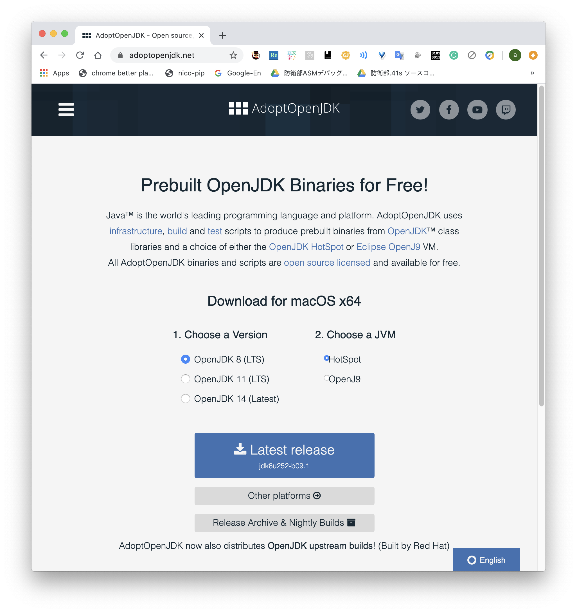
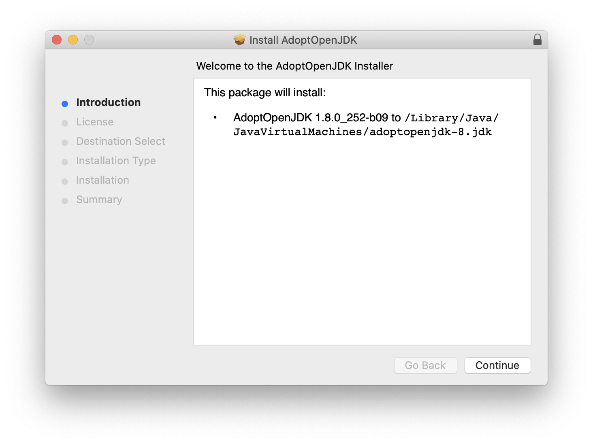
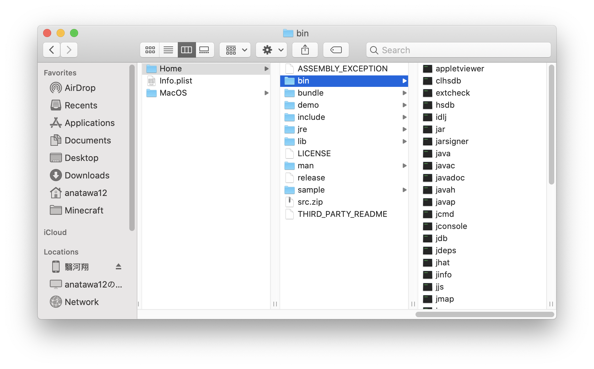
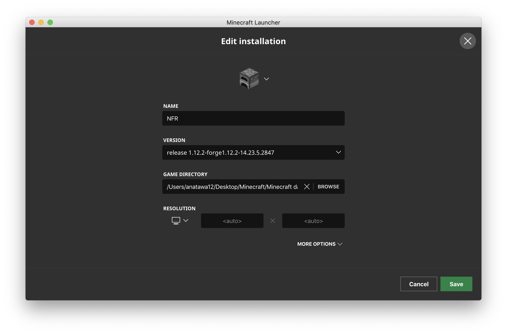
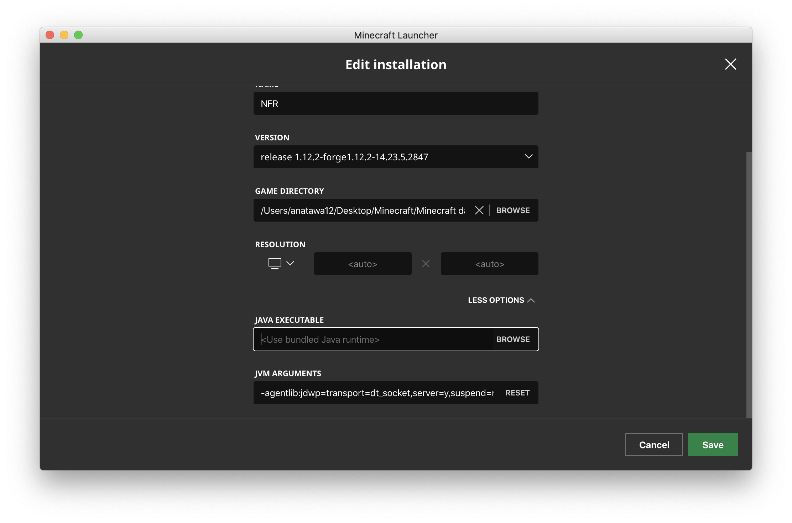

# hs_errといいうファイルとともにクラッシュする人へ(macOS)

- [macOS](./mac.md)
- [windows](win.md)

RTMの入ったマインクラフトで遊んでいたり起動時にcrash-reportsにファイルが生成されずに
クラッシュすることがあります。その際にmodsやcrash-reportsがあるディレクトリに`hs_err_<数字>.log`
というファイルが生成されていませんか？この場合はマインクラフトではなく、javaがクラッシュしているため、
通常の方法では対応ができませんが、少し面倒ですが、javaを更新することで回避することが出来ます。

## javaの更新手順

1. 新しいバージョンのjavaをインストール
1. そのjavaをマインクラフトで使用するように指定する

## 新しいバージョンのjavaをインストール

まず最初に、マインクラフト1.12.2ではjavaのバージョン8を使用する必要がありますから、
java9以降のものを入れないように気をつけてください。

javaは現在様々な企業などから提供されていますが、今回はadoptopenjdkというjavaを
インストールします。他のものを使う場合はadoptopenjdkをインストールする必要はありません。

## 新しいバージョンのjavaをインストール

まず最初に、マインクラフト1.12.2ではjavaのバージョン8を使用する必要がありますから、
java9以降のものを入れないように気をつけてください。

javaは現在様々な企業などから提供されていますが、今回はadoptopenjdkというjavaを
インストールします。他のものを使う場合はadoptopenjdkをインストールする必要はありません。

### adoptopenjdkのインストール方法

[adoptopenjdkの公式サイト](https://adoptopenjdk.net/) にアクセスいます

Choose a VersionでOpenJDK 8 (LTS)を選択し、Latest releaseをダウンロードしてください。

ダウンロードしたファイルを実行してインストーラを起動してインストールしてください。
その際に次の画面のインストール先(場所)を覚えておいてください

Finderで先ほどのインストール先/Contents/Home/binを開いてください。

### そのjavaをマインクラフトで使用するように指定する

起動設定の編集画面でmore optionsを選択します

下に`JAVA EXECUTABLE`というところの`BROWSE`をクリックします。

でてくるエクスプローラーのGUIにさっき開いたディレクトリにあるjavaを
ドラックアンプドロップしてopenをクリックします

Saveすれば変わっています。

anatawa12(翳河翔)
